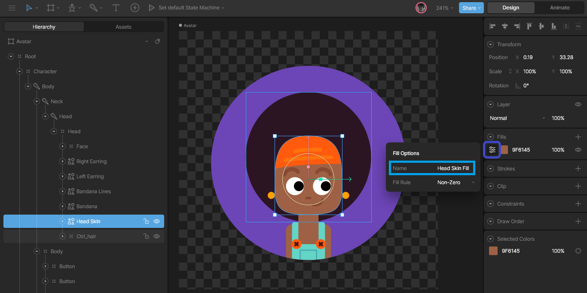
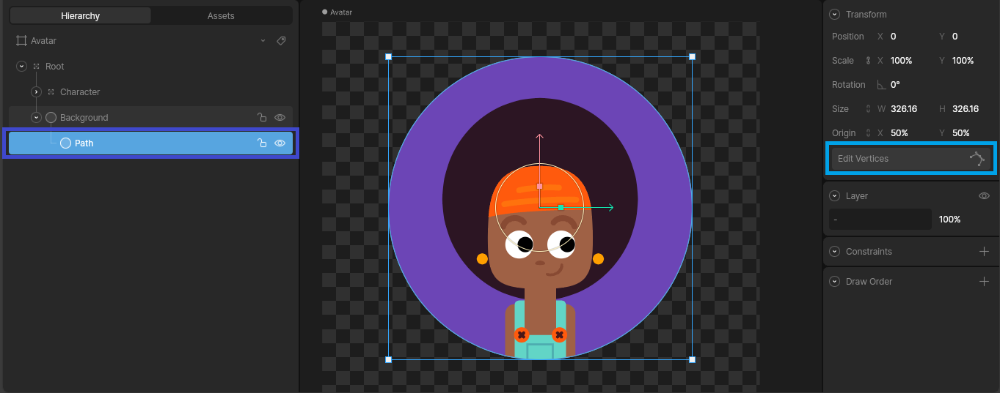
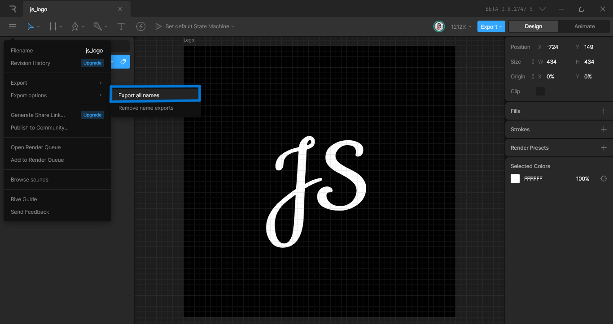

# Rive Color Modifier

This package provides an easy and straightforward way to modify the Color of specific Components within [Rive](https://rive.app/) Animations at runtime, while also maintaining their opacity (alpha values) throughout the animation.

## Demo


## Getting started

Before starting to work with this package, it's essential to understand that it is necessary to have a .riv file, which must contain the animations you wish to modify. If you have not yet created any animation in Rive or are unfamiliar with its editor, there's no need to worry. You can visit the [community](https://rive.app/community) section to explore and edit the impressive animations shared by the community. In my case, I borrowed this fabulous animation from [JcToon](https://rive.app/@JcToon/). Once you access the editor, it is crucial to consider some key aspects before integrating the file into our project.

1- It is crucial to assign a name to the Artboard that houses the animation you wish to alter. This step is essential because we will need to later retrieve the artboard using the assigned name in the following manner:
  
```dart
// This method will be called in the initState method of your StatefulWidget
Future<void> _load() async {
  // Load the RiveFile from the asset bundle
  final avatarFile = await RiveFile.asset('assets/avatar.riv');
  // Get the artboard containing the animation you want to modify
  final artboard = avatarFile.artboardByName('Avatar')!;

  setState(
    () {
      // Initialize the _avatarArtboard variable previously declared
      _avatarArtboard = artboard;
    },
  );
}
```

Thus, we can then pass the previously initialized variable _avatarArtboard to our `RiveColorModifier`.

Changing the name of the Artboard in the Rive editor is a straightforward process: simply double-click on any of the two highlighted areas and change the name to one you find most suitable for yourself.


2- Then, make sure that each Shape has a unique name, as this will be the identifier we use to modify the color of each one. To change the name of a Shape, simply click on the current name and modify it to the one you desire.


Next, I'll show you an example of how the name of each Shape is used to modify its color in the code:

```dart
RiveColorModifier(
  artboard: _avatarArtboard,
  components: [
    //* EARRING COLOR
    RiveColorComponent(
      shapeName: 'Left Earring', // Shape name
      // rest of the code
    ),
    RiveColorComponent(
      shapeName: 'Right Earring', // Shape name
      //...
    ),
    //* BANDANA LINES COLOR
    RiveColorComponent(
      shapeName: 'Bandana Lines', // Shape name
      //...
    ),
    //* BANDANA COLOR
    RiveColorComponent(
      shapeName: 'Bandana', // Shape name
      //...
    ),
    //* HEAD SKIN COLOR
    RiveColorComponent(
      shapeName: 'Head Skin', // Shape name
      //...
    ),
  ],
)
```

3- Finally, it's important that each Fill or Stroke you wish to modify has a unique name. To change the name of a Fill or Stroke, simply click on the current name and modify it to the one you desire.

- First, select the Shape that contains the Fill or Stroke you wish to modify.

 *As we can see on the right, in this case, it's a Fill.*

- Then click on the highlighted area and change the name to the one you desire.

 *I always recommend naming it using the same name assigned to the Shape plus "Stroke" or "Fill" depending on the type.*

Next, I'll show you an example of how the name of each Fill or Stroke is used to modify its color in the code:

```dart
RiveColorModifier(
  artboard: _avatarArtboard,
  components: [
    //* EARRING COLOR
    RiveColorComponent(
      shapeName: 'Left Earring',
      fillName: 'Left Earring Fill', // Fill name
      color: Colors.yellow, // Color
    ),
    RiveColorComponent(
      shapeName: 'Right Earring',
      fillName: 'Right Earring Fill', // Fill name
      color: Colors.yellow, // Color
    ),
    //* BANDANA LINES COLOR
    RiveColorComponent(
      shapeName: 'Bandana Lines',
      strokeName: 'Bandana Lines Stroke', // Stroke name
      color: Colors.orange.shade300;, // Color
    ),
    //* BANDANA COLOR
    RiveColorComponent(
      shapeName: 'Bandana',
      fillName: 'Bandana Fill', // Fill name
      color: Colors.orange, // Color
    ),
    // ...
```

> IMPORTANT: You should always consider whether the Shape you want to modify has a Fill or Stroke, as this will determine whether you should use the fillName or strokeName in the corresponding `RiveColorComponent`. Something to keep in mind is that if the Shape you wish to modify has both a Fill and a Stroke, you will need to create two `RiveColorComponent`s for that Shape, one for the Fill and another for the Stroke.

On certain occasions, we might encounter a component we want to change that, instead of being a Shape, is a geometric figure. In this case, what we need to do is select the figure and edit the vertices to turn it into a Shape, as shown in the following image.

- Expand the element tree of the figure.



- Select the Path of the figure and click the "Edit Vertices" button.


- Then click the "Convert" button.


- And voila! It's now a Shape!!



## How It Works

This package allows you to dynamically modify the Color properties of specific components in your Rive Animations. Below is an example demonstrating how to use `RiveColorModifier` along with `RiveColorComponent` to change the color of particular [Shapes](https://help.rive.app/editor/fundamentals/shapes-and-paths) within an animation.

You just have to provide the [Artboard](https://help.rive.app/editor/fundamentals/artboards) of the [Rive](https://rive.app/) asset you are using to the RiveColorModifier, and in the components property, you pass a RiveColorComponent for each Shape you want to change the color of. You also pass the name of the [Fill](https://help.rive.app/editor/fundamentals/fill-and-stroke) or [Stroke](https://help.rive.app/editor/fundamentals/fill-and-stroke) and then the Color you want it to have. Super simple!

```dart
// Example of how to use RiveColorModifier
RiveColorModifier(
  artboard: _yourArtboard,
  components: [
    // Changing the color of a Shape's Fill
    RiveColorComponent(
      shapeName: 'Your Shape Name',
      fillName: 'Your Fill Name',
      color: isDarkMode ? Colors.white : Colors.black, // Dynamic color depending on the theme
    ),
    // Changing the color of a Shape's Stroke
    RiveColorComponent(
      shapeName: 'Your Shape Name',
      strokeName: 'Your Stroke Name',
      color: isDarkMode ? Colors.white : Colors.black, // Dynamic color depending on the theme
    ),
  ],
)
```

If you want to see a complete example, you can check the [example](https://pub.dev/packages/rive_color_modifier/example) provided in the package.

## Additional information

For more information on how to use this package, or if you want to contribute, please visit the [GitHub repository](https://github.com/JSimonDev/rive_color_modifier). If you encounter any issues or have feature requests, please file them in the issue tracker.

Don't forget to like the package if you find it useful, and if you have any suggestion, please let me know.

Your feedback and contributions are welcome to help improve this package!
